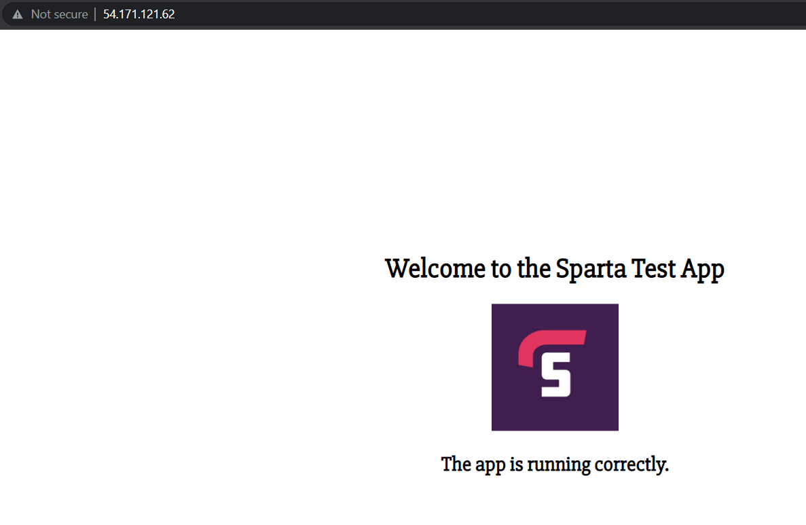

# Autoscalling 

## Autoscalling group:
An autoscalling group contains a collection of EC2 instances. These groups can be used for the purpose of automatic scaling and mangement. [Read more here at the official AWS site](https://docs.aws.amazon.com/autoscaling/ec2/userguide/auto-scaling-groups.html)

## the process
We have gone over these processes in previpus repos.

The way we will make use of auto scaling groups is by:
1. Creating an EC2 instance (in our case an instance that runs nginx)
2. Creating an AMI of the instance
3. Creating a launch template 

    Note: this lanch template can be configured and allows us to specify the AMI 


## creating scaling group

### step 1: choose template

name the group and choose a template:


### step 2: AV zone:

choose correct zones:
1a, 1b, 1c.


### step 3: load balancer:
set up balancers:


### step 4: capacity and policy
The requirments:


And our policy:


### step 5: Tag:

Tag matters, or else wont be able to find after.


### step 6: review

look over and launch!


## check load balancers

search for 2oad balancers" in the search tab. and select the EC2 one:


Navigate inside and select the DNS location, search this in the search bar.


Result:


# Setting up sparta app

After having a working nginx instance, ami and template. 
we can use the existing Image to create a working Sparta App Instance, Image and template.

## Sparta Instance

My instance already has Nginx and the APP files uploaded to it. I created a new instance and added the following User Data:
```
#!/bin/bash

curl -sL https://deb.nodesource.com/setup_12.x | sudo -E bash -

sudo apt-get install nodejs -y
sudo npm install pm2 -g

cd /home/ubuntu/app
sudo npm install
sudo pm2 start app.js --update-env

sudo pm2 restart app.js --update-env
```

This results in the following:


## Reverse proxy:
Now that the app is working

we need to ssh into the instance and input the reverse proxy.


after ssh ing in, type this command in the terminal:
```
sudo sed -i 's+try_files $uri $uri/ =404;+proxy_pass http://localhost:3000/;+' /etc/nginx/sites-available/default
```
thereafter enter the following:
```
sudo systemctl restart nginx
```
```
sudo nano /etc/nginx/sites-available/default
```
```
cd app
```
```
 pm2 start app.js
```
This should hopefully result in:


this resulted in the reverse prox working:


## Create AMI
Now we can create an AMI using the instance. A tutorial of this can be found above. Doing so results in this:


I created an instance from this and it worked correctly!

## Launch template
Now we need to create a template, this is done above, but here it is:

NOTE: we need to add some code in the user data area:
```
#!/bin/bash
cd /home/ubuntu/app
npm install
pm2 start app.js
```


## ASG
 Now an autoscalling group needs to be created:
 the settings are above:


## LB ACCESS
Now we create a load balancer, to balance the instances:


after searching the DNS in the URL:
```
tech230-masum-SpartApp-LB-444638491.eu-west-1.elb.amazonaws.com
```
Success!


